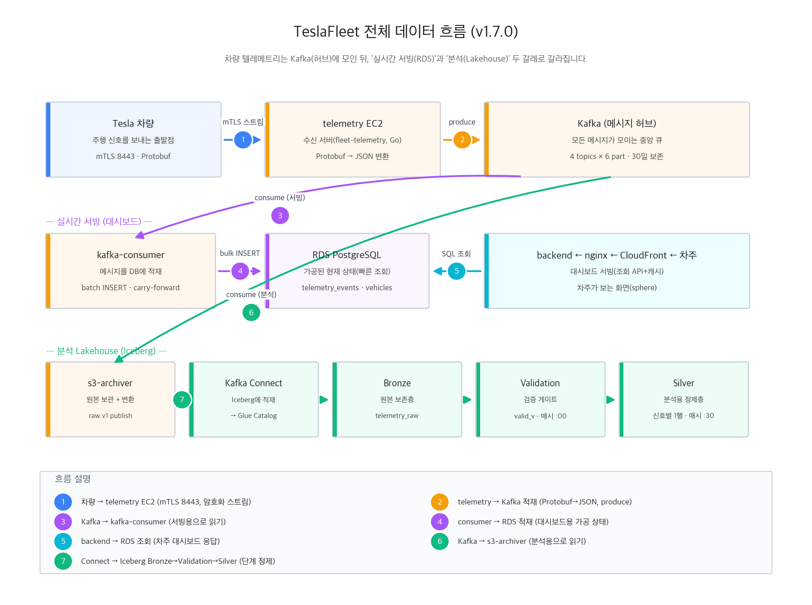
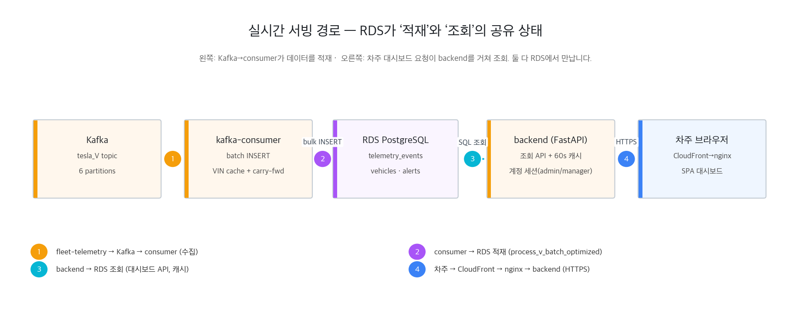
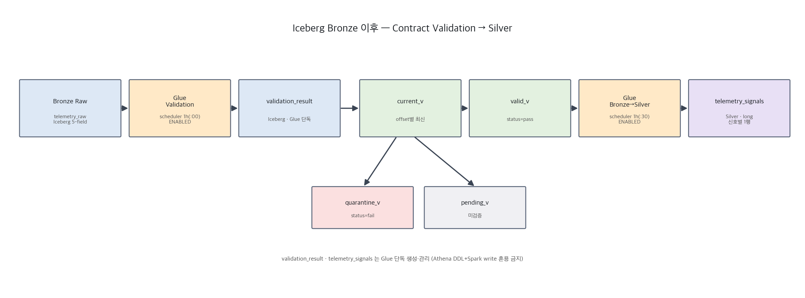
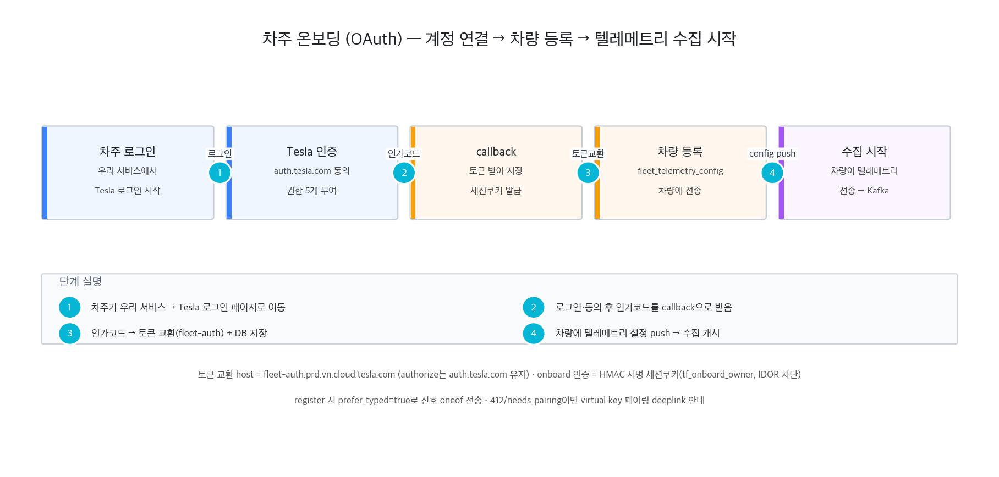
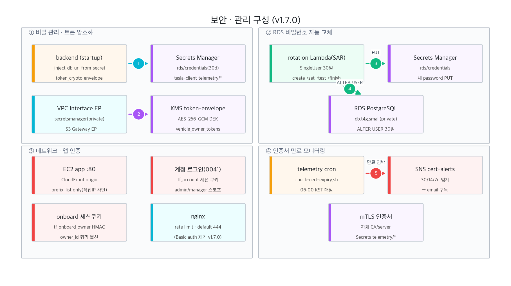
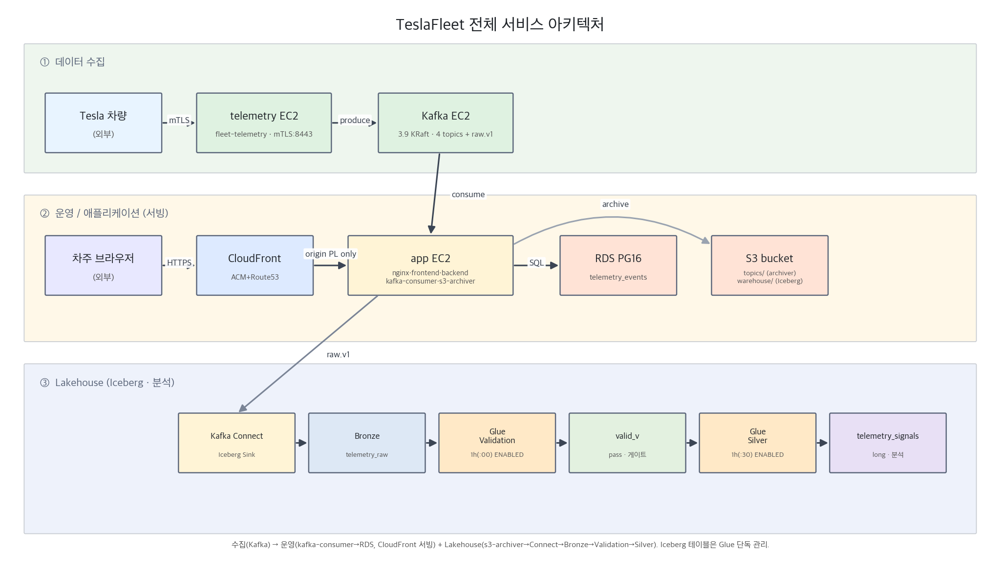

# TeslaFleet 아키텍처 안내 (v1.9.0)

> 이 문서는 **처음 보는 사람도 전체 그림을 이해**할 수 있도록 쉽게 쓰였습니다.
> 모든 수치·이름은 **실제 코드/인프라(2026-07, alembic head 0050)** 에서 확인한 값입니다.
> 도식은 `docs/figures/`(PNG) + `docs/teslafleet_diagrams_2026-06-11.pdf`(합본)에 있습니다.
> 📖 **모르는 기술 용어가 나오면** → [`docs/GLOSSARY.md`](GLOSSARY.md)(초보자용 용어집 — FrontEnd·BackEnd·인프라·데이터 4꼭지).

---

## 0. 한 문장 요약

> **Tesla 차량이 보내는 주행 데이터를 모아서, ① 실시간 대시보드로 보여주고 ② 분석용 데이터레이크(Iceberg)에 차곡차곡 쌓는 시스템.**

비유하면 — 차량은 *물을 흘려보내는 수도꼭지*, **Kafka**는 그 물이 모이는 *중앙 물탱크(허브)*, 거기서 물이 두 갈래 파이프로 갈라집니다:
- **서빙 파이프** → 정수기(RDS)로 보내 바로 마실 수 있게(대시보드)
- **분석 파이프** → 큰 저수지(S3/Iceberg)에 저장해 나중에 분석

---

## 1. 전체 데이터 흐름 한눈에

**위 → 아래로 읽으면 됩니다.**

1. **Tesla 차량 → telemetry EC2** : 차량이 `mTLS:8443`로 암호화된 Protobuf 스트림을 보냅니다. (차주가 미리 페어링·온보딩한 VIN만)
2. **telemetry EC2 → Kafka** : `fleet-telemetry`(Go 서버)가 Protobuf를 JSON으로 풀어 Kafka에 `produce`.
3·6. **Kafka(허브)에서 두 갈래로 갈라짐** — 같은 데이터를 두 소비자가 각자 읽습니다(독립 consumer group).
   - ③ **실시간 서빙** 갈래 → `kafka-consumer`
   - ⑥ **분석(Lakehouse)** 갈래 → `s3-archiver`
4·5. **서빙** : `kafka-consumer`가 RDS에 적재(④) → `backend`가 RDS를 조회(⑤)해 대시보드로 보여줌.
7. **분석** : `s3-archiver` → `Kafka Connect` → `Bronze` → `Validation` → `Silver` (Iceberg 데이터레이크).

> 핵심: **Kafka가 가운데 허브**이고, 같은 데이터가 "바로 보여주는 길"과 "쌓아두는 길"로 **동시에** 흘러갑니다.

---

## 2. 데이터 수집 (차량 → Kafka)

| 구성요소 | 무엇인가 | 핵심 수치 |
|---|---|---|
| **Tesla 차량** | 페어링된 VIN이 텔레메트리 전송 | mTLS, Protobuf |
| **telemetry EC2** | `fleet-telemetry`(teslamotors 오픈소스, Go) 컨테이너 | **t3.small**, public subnet + EIP, 포트 **8443**(수집)·9273(메트릭) |
| **Kafka EC2** | Apache **Kafka 3.9.0**, KRaft 단일 노드 | **t3.medium**, `:9092`(PLAINTEXT), 전용 100GB gp3 + DLM 7일 스냅샷 |
| **토픽 4종** | `tesla_V`(신호) · `tesla_alerts` · `tesla_connectivity` · `tesla_errors` | 각 **6 partitions**, replication 1, **30일** 보존 |

- 차량이 보내는 인증서(mTLS PKI)는 **Secrets Manager**(`/teslafleet/sphere-dev/telemetry/*`)에서 받아옵니다.
- `auto.create.topics.enable=false` — 토픽은 terraform이 명시 생성(오타 토픽 방지).
- 토픽 목록의 **단일 진실원천**은 `backend/app/constants.py`(`KAFKA_TOPICS`).

---

## 3. 실시간 서빙 경로 (대시보드)

**RDS가 가운데에 있고, 왼쪽에서 "적재", 오른쪽에서 "조회"가 만나는 구조**입니다.

- **왼쪽(적재)** : `Kafka → kafka-consumer → RDS`
  - `kafka-consumer`는 `tesla_V`를 **batch INSERT**(`process_v_batch_optimized`, 단건 대비 25~40배)로 적재.
  - VIN→vehicle_id 캐시 + **carry-forward**(빠진 신호를 직전 값으로 채워 어떤 시점도 빈칸 없이 분석 가능).
  - `tesla_V`는 0040 유니크 인덱스 + `ON CONFLICT DO NOTHING`으로 exact 재전송 중복을 INSERT 단계 차단, `tesla_alerts`도 `vehicle_alerts`에 `ON CONFLICT DO NOTHING`.
- **오른쪽(조회)** : `차주 → CloudFront → nginx → backend → RDS`
  - `backend`(FastAPI)가 RDS를 조회해 대시보드 API 제공(무거운 집계는 캐시 — `data_source`별 TTL: **live 60초 / seeded·simulated 600초(10분)**, commit bdcf724).
  - **차량 심화 분석 10종(v1.7.7~v1.7.8, `app/routers/analytics.py`, `GET /api/v1/telemetry/...`)** — `charge-sessions`·`efficiency`·`driving-events`·`speed-histogram`·`places`·`battery-health`·`vampire-drain`·`activity-calendar`·`utilization`(가동률·커버리지, v1.7.8) + `fleet-baseline`. typed 컬럼만 집계(다운샘플 무관)·결과 캐시(TTL live 300초/정적 1800초)·`statement_timeout=60초` 초과 시 504. 0047/0048/0049/0050 부분/커버링 인덱스로 cold 첫 조회 가속(0049 charge-sessions·0050 places 504 해소·index-only). 응답 additive — `driving-events`에 `speed_matrix`(속도밴드×이벤트 유형), `charge-sessions`에 `habits`(충전 습관 점수·DC 서브점수 100−40·비율). ⭐충전 판정·가동률 분류는 **정지·속도·충전전력 가드**로 sticky 'Charging'(carry-forward 고착) 주행/정차 오염 제외. 거리(efficiency·driving·activity)는 **daily-min-delta**로 odometer 누출 면역(v1.7.9).
  - **지도 경로 표시 게이팅(FE)** — 조회 기간이 **7일 초과**면 경로 선·경보 알림 아이콘을 숨기고(지도·현재 위치 마커는 유지), **7일 이하**만 전체 표시. `VehicleDashboard`가 `calendarSpanDays<=7`(`routeAllowed`)로 판정 → 초과 시 `VehicleRouteMap` `hidePath` + 경보 `EMPTY_ALERT_POINTS` + dense route fetch 생략(RDS 과부하 방지).
  - **계정 로그인 필수(v1.7.0)** — admin(전체)/manager(자기 고객사만) 세션 쿠키. admin 영역은 admin 세션(운영 스크립트는 X-Admin-Key).

**RDS 핵심 수치**
- 인스턴스 **db.t4g.small**, PostgreSQL **16.13**, **private subnet**(외부 직접 접근 불가, SG는 app/rotation Lambda만 5432 허용).
- 스토리지 gp3 20GiB(최대 **200GiB** 자동확장 — 2026-06-11 audit INFRA-2: allocated×2=40 헤드룸 부족·천장 도달 시 적재 중단 위험이라 절대 천장 200으로 분리), **암호화 on**, 백업 7일.
- **15개 테이블** (vehicles / telemetry_events / vehicle_alerts / vehicle_owner_tokens / customers / seed_imports / replay_imports / app_settings / telemetry_config_signals / sim_runs / sim_delete_events / reverse_geocodes / accounts / account_sessions / **account_audit_log**), **alembic head 0050** (0041: 계정 로그인 — admin/manager 권한 + DB 세션 · 0042: 계정 보안 강화 — 로그인 잠금·강제 비번변경·세션 메타·감사로그 account_audit_log · 0043: account_audit_log 복합 인덱스(event, created_at) · 0044: account_audit_log IP/국가/도시 컬럼 — 보안 감사 포렌식 · 0045: account_sessions IP/국가/도시 — 활성 세션 표기 · 0046: accounts OTP 앱(TOTP) MFA 컬럼 7종 — 계정 로그인 2단계 인증 · 0047: telemetry_events 심화 분석 가속 인덱스 3종(harsh_accel·charging 부분 + analytics_metrics 커버링) · 0048: telemetry_events battery/vampire 커버링 인덱스 — 차량 심화 분석 10종(utilization 포함) cold 스캔 가속 · 0049: ix_te_charging(넓은 predicate) DROP 후 charge-sessions 필터와 정확히 일치하는 좁은 부분 인덱스 ix_te_charging_active(charge_state='Charging' AND charging_power_kw>0 AND (speed_kph IS NULL OR speed_kph<=1))로 교체 — charge-sessions 504 해소 · 0050: ix_te_places 커버링 부분 인덱스((vehicle_id,timestamp) INCLUDE(latitude,longitude) WHERE speed_kph<=3.0 AND lat/lng NOT NULL) — 자주 가는 장소 places 504 해소·index-only). 현행 telemetry_events 분석 인덱스 = harsh_accel·charging_active·analytics_metrics·battery_vampire·places.
- **비정규화**(0024): `vehicles.event_count/first/last_event_at`로 매 요청 COUNT/MIN/MAX(이전 90초·504) 회피.
- **`vehicles.latest_telemetry`**(0027 JSONB): 메인 대시보드가 읽는 carry-forward 스냅샷.
- DB 접속정보(`DATABASE_URL`)는 코드에 없고 **Secrets Manager에서 런타임 fetch**.

---

## 4. 분석 경로 — Lakehouse (Iceberg)

원본을 잃지 않고 **단계적으로 정제**하는 데이터레이크(메달리온 아키텍처)입니다.

1. **s3-archiver** : Kafka 4토픽을 읽어 ① S3에 raw JSONL 보관(`topics/`, SIM 메시지는 skip) + ② **5-field envelope**(`event_id/source/event_time/ingested_at/raw_payload`)로 변환해 `telemetry.raw.v1` 토픽에 재발행.
2. **Kafka Connect**(별도 EC2 **t3.large**, Iceberg Sink) : `telemetry.raw.v1`을 consume → **Bronze** Iceberg 테이블(`teslafleet_bronze_dev.telemetry_raw`)에 commit. (auto-create, `day(ingested_at)` 파티션) **⚠️ 현재 stopped**(v1.8.1, 2026-07-02 — 텔레메트리 정지·Glue OFF로 sink할 데이터 없어 유휴 → ~$60/월 절감·재시작 가역, `aws ec2 start-instances i-0037d21d1503c2398`). 즉 Bronze 적재 경로는 현재 dormant이며 텔레메트리·파이프라인 재개 시 함께 start 필요.
3. **Validation**(Glue Spark, **매시 :00**, 1시간 주기) : Bronze를 검증(필수 5필드 non-null·event_time 파싱·raw_payload JSON에 vin 존재) → `..._validation_result` + Athena 뷰 4종(`telemetry_contract_validation_current_v / telemetry_valid_v / telemetry_quarantine_v / telemetry_pending_v`).
4. **Silver**(Glue Spark, **매시 :30**, 1시간 주기, 실행 ~5~6분(GL-2 ingested_at 워터마크 증분 — 첫 풀 backfill run만 ~15~19분)) : `valid_v`(통과분)만 받아 신호를 **long 포맷**(`telemetry_signals`, 신호별 1행)으로 전개.
   - dedup 자연키 = `(vin, event_time, raw_topic, signal_key)` — `event_id`는 archive마다 uuid4라 replay 비멱등이므로 키에서 제외(lineage 컬럼으로만 보존).
   - 파티션 `day(event_time)`, `fanout-enabled=true`.
   - **비용 최적화(2026-06-08)**: 주기 10/12분→**1시간**(Glue ~$805→~$155/월). '데이터 현황'(/admin/data-status)의 **ON/OFF 토글**(`POST /admin/lakehouse/pipeline-toggle` → EventBridge Scheduler state)로 안 쓸 땐 정지(과금 ~0). state는 terraform `ignore_changes=[state]`로 런타임 토글 보존, OFF 동안 미처리분은 재개 시 left-anti 증분 self-heal.

> **단일 엔진 규칙**(중요): Iceberg 테이블은 **한 엔진만** 생성·write — `telemetry_raw`=Connect, `validation_result`=Validation Glue, `telemetry_signals`=Silver Glue. (Athena DDL + Spark write 혼용 시 메타데이터 깨짐)

5. **⭐데이터 레이크 분석 화면(v1.9, `/admin/data-lake`, admin 전용)**: Silver(253 신호·13.6M 이벤트·실차 7 VIN·2025-01~11)·Bronze 검증을 **Athena로 조회하는 정적 히스토리 분석** — RDS 화면이 구조화하지 않는 신호(셀 전압·모터 토크/전류·페달·충전기·내비 ETA)를 시계열로. 카드 4종(신호 탐색기·주행/에너지 히스토리·배터리 셀 심화·검증 상세, 전부 on-demand 버튼). 백엔드 `admin/datalake/*` 5 엔드포인트 — **쿼리 윈도우 ≤30일 서버 강제** + workgroup 1GB cutoff + 캐시(1h/6h) + 세마포어(2) + 타임아웃 시 서버측 쿼리 취소. 파이프라인 OFF라 데이터는 스냅샷(배지 표기) — RDS 실시간 화면과 완전 별개.

---

## 5. 차주 온보딩 (OAuth)

차주가 자기 Tesla 계정을 연결하고 차량을 등록하면, 그 차량이 텔레메트리를 보내기 시작합니다.

1. **로그인** : `GET /api/v1/auth/login` → Tesla `authorize`로 redirect.
2. **Tesla 인증** : 차주가 `auth.tesla.com`에서 로그인·동의(scope 5개: `openid / offline_access / vehicle_device_data / vehicle_location / vehicle_cmds`).
3. **callback** : 인가코드를 **`fleet-auth.prd.vn.cloud.tesla.com`** 에서 토큰으로 교환(2026-06 전환) → `vehicle_owner_tokens`에 **KMS 봉투암호화** 저장 + **세션쿠키 발급**.
4. **차량 등록** : `onboard/register` → Tesla에 `fleet_telemetry_config` push(`prefer_typed=true`). **프록시 활성 시(`TESLA_USE_COMMAND_PROXY=1`, 라이브 적용됨)** 이 push는 **Tesla Vehicle Command Proxy(`tesla-http-proxy`)가 파트너 개인키로 서명 후 전송**(공식 요구 — public-key 등록 앱은 서명 필요). 페어링 필요 시(412) virtual key deeplink 안내.
5. **수집 시작** : 등록된 차량이 `mTLS`로 텔레메트리 전송 → Kafka(2장으로 합류).

> **보안 포인트**
> - `authorize` host는 `auth.tesla.com` 유지(공식 표준), **token 교환만** fleet-auth.
> - onboard 인증 = **HMAC 서명 세션쿠키**(`tf_onboard_owner`, `.tesla.modapl.dev`, 30일). `?owner_id=` 쿼리는 **신뢰하지 않음**(IDOR 차단).

---

## 6. 보안 · 관리 구성

| 그룹 | 내용 |
|---|---|
| ① **비밀 관리·토큰 암호화** | DB 접속정보·Tesla 자격은 **Secrets Manager**, 차주 토큰은 **KMS 봉투암호화(AES-256-GCM)**. private 통신은 **VPC Interface Endpoint**(secretsmanager) + S3 Gateway EP. |
| ② **RDS 비밀번호 자동 교체** | **SAR rotation Lambda**가 30일마다 `create→set→test→finish`로 새 비밀번호를 Secrets Manager에 PUT + RDS `ALTER USER`. |
| ③ **네트워크·앱 인증** | app `:80`은 **CloudFront origin-facing prefix-list만** 허용(직접 IP 차단). **계정 로그인(v1.7.0)**: 전 데이터 API는 세션 쿠키(`__Host-tf_account`, v1.7.1 rename) 필수 — admin/manager(고객사 스코프) role, Manager는 자기 고객사 데이터만. admin 영역은 admin 세션(또는 운영 스크립트용 X-Admin-Key), onboard는 별도 **세션쿠키**(`tf_onboard_owner`), nginx는 rate limit + 알 수 없는 Host `444`(Basic auth는 v1.7.0에서 제거 — 계정 로그인 대체). **OTP(TOTP) 다단계 인증(v1.7.5)**: 비번 검증 후 등록(mfa_enabled) 계정이면 단기 챌린지 토큰만 발급하고 `/login/verify-otp`(OTP 6자리 또는 백업코드)로 세션 발급. `ACCOUNT_MFA_ENFORCE=1`이면 미등록 계정은 데이터/admin 라우트 `403 mfa_setup_required`로 등록 강제(must_change 게이트 동형). TOTP secret은 KMS 봉투암호화 저장·코드 재사용 차단. 복구=백업코드/admin reset-mfa/비상 `ADMIN_MFA_RESET=1`. |
| ⑥ **Tesla Command Proxy 서명(2026-06-23 활성)** | public-key(.well-known) 등록 앱은 `fleet_telemetry_config` create를 **파트너 개인키로 서명**해야 한다(Tesla 공식). `tesla-http-proxy`(image `tesla/vehicle-command`, distroless UID 65532) 사이드카가 서명 전담 — **전용 `command-proxy-net`에 격리, backend만 join**(인터넷 비노출), backend↔proxy는 self-signed TLS 검증. config push 3곳(onboard.register·settings.validate·repush)만 프록시 경유, 다른 Fleet API는 직접. 토글 `TESLA_USE_COMMAND_PROXY`(.env 보존)·롤백=0 후 재배포. |
| ④ **인증서 만료 모니터링** | telemetry EC2 cron(매일 06:00 KST)이 mTLS 인증서 만료를 검사 → 30/14/7일 임박 시 **SNS → email**. |
| ⑤ **장애 알림(RDS 저장공간, v1.7.2)** | **RDS FreeStorageSpace < 2GiB**(5분×2회) 시 **CloudWatch 알람 → 전용 SNS 토픽(`ops-alerts`, cert 알림과 수신자 분리) → 이메일**(과거 DiskFull 사고 2회 재발 방지). 알람 **기본 OFF** — 운영자가 '데이터 현황'의 Admin UI(`/admin/alerts/*`)에서 ON/OFF 토글 + 수신 이메일 구독(SNS subscribe·1회 confirm)을 관리(구독은 terraform이 아닌 boto3 UI 전담). ⚠️ **전달 규칙**: SNS는 **확인된(confirmed) 구독자에게만** 발송 — 이메일 추가 후 수신함에서 확인 링크를 클릭하지 않은 **미확인(PendingConfirmation) 구독은 메일을 못 받는다**. 따라서 **알림이 ON이어도 확인된 수신자가 0명이면 경보가 아무에게도 안 가는 silent 무전달**(AlertsCard가 `onButNoRecipient`로 경고). 수신 목록은 **로그인 계정과 완전 별개**(SNS 구독 ≠ accounts) — 로그인 계정(예: `dev@modapl.com`)이라도 목록에 추가·확인해야 받고, 비-로그인 주소(ops 별칭 등)도 자유롭게 등록 가능. ⚠️ 현재 **RDS 저장공간 알람만** 구현 — consumer 정체·24h 무적재 알람은 컨테이너 로그가 CloudWatch에 없어(docker json-file 드라이버) 백엔드 커스텀 메트릭 publisher 선행 필요 → 추후 확장. |

### 6.1 방화벽 — 보안 그룹 (네트워크 노출 경계)

방화벽은 **AWS 보안 그룹(Security Group)** 으로 구현된다(대부분 `infra/modules/security/main.tf` — 단 VPC Endpoint SG(`vpce-sg`)는 secretsmanager Interface Endpoint에 부착돼 `infra/modules/network/main.tf`에 정의). 커스텀 Network ACL·WAF는 없고(기본 NACL allow-all + SG가 1차 방화벽 = AWS 표준), egress는 전 SG가 `0.0.0.0/0`(패키지 다운로드·S3/Glue·SSM·Kafka produce용).

**인터넷에서 직접 닿는 곳은 단 2개** — 나머지는 전부 VPC 내부(SG 참조):

| 리소스 (SG) | 포트 | 허용 출처(ingress) | 비고 |
|---|---|---|---|
| **app EC2** (`ec2-sg`) | 80 | **CloudFront origin-facing prefix-list만**(`com.amazonaws.global.cloudfront.origin-facing`) | `0.0.0.0/0` 아님 — public IP 직접 접근은 SG에서 차단(CloudFront 우회+Host 위조 경로 봉쇄) |
| **telemetry EC2** (`telemetry-sg`) | 8443 | `0.0.0.0/0`(전 인터넷) | Tesla 차량 **mTLS**(클라 인증서)로 보호 — 차량 직접 수신이라 개방 불가피 |
| **RDS** (`rds-sg`) | 5432 | **app-sg + rotation-lambda-sg** 참조만 | CIDR 개방 0(VPC 내부 전용) |
| **Kafka 브로커** (`kafka-sg`) | 9092 / 9093 | 9092 ← app·kafka-connect·telemetry SG / 9093(KRaft 컨트롤러) ← self | VPC 내부 전용 |
| **Kafka Connect** (`kafka-connect-sg`) | 8083(REST) | **app-sg 참조만**(SSM 터널 경유 운영) | VPC 내부 전용 |
| **VPC Endpoint** (`vpce-sg`) | 443 | **VPC CIDR만** | Secrets Manager Interface EP |

- **SSH(22) 완전 차단** — ingress 규칙 자체가 없다. 서버 접속은 **SSM Session Manager** 전용(인바운드 포트 0).
- ⚠️ **알려진 보강 여지(미적용·propose)**: app:80을 막는 prefix-list는 **전 AWS 계정 공유 글로벌 목록**이라 "CloudFront 경유"는 막아도 "**우리** distribution 경유"까지 바인딩하진 못한다(제3자 CloudFront+Host 위조 시 origin 도달 가능). 닫으려면 CloudFront가 주입하는 **origin custom header**(`X-Origin-Verify`=Secrets Manager 비밀값)를 nginx가 검사해 불일치 시 `444`로 차단해야 한다(terraform+nginx+배포 결합 → apply 승인 대기).

### 6.2 고정 공인 IP (Elastic IP)

외부에서 닿는 두 리소스(§6.1)에만 **고정 공인 IP(EIP)** 가 붙는다 — 재부팅·재배포·인스턴스 교체에도 주소가 바뀌지 않아 DNS·차량 mTLS 엔드포인트가 안정적으로 유지된다. EIP는 **terraform이 관리**(코드가 진실의 원천)하며, 나머지 내부 리소스(Kafka·Kafka Connect·RDS)는 고정/공인 IP가 **없다**(VPC 내부 SG 참조 통신만).

| 고정 IP (EIP) | 이름 태그 | 인스턴스 | 사설 IP | 역할 / 노출 | terraform |
|---|---|---|---|---|---|
| **54.116.100.27** | `teslafleet-dev-eip` | `i-0c939b19727922d40` (app) | 10.0.0.117 | **앱 origin** — `sphere.tesla.modapl.dev`를 CloudFront가 받아 이 EIP `:80`으로 포워딩. SG가 **CloudFront prefix-list만** 허용(EIP 직접 접근 차단) | `modules/compute/main.tf` (`aws_eip.this`) |
| **43.201.202.157** | `teslafleet-dev-telemetry-eip` | `i-01a74374a80cdcaea` (telemetry) | 10.0.0.138 | **텔레메트리 수신** — `stream.tesla.modapl.dev`(Route53 A 레코드가 이 EIP를 직접 가리킴), **8443 mTLS 직접 노출**(CloudFront 미경유) | `modules/telemetry/main.tf` (`aws_eip.telemetry` + Route53) |

- **고정 IP 없는 내부 리소스**: Kafka 브로커(`i-018a7c8e7763687f8`, 사설 10.0.0.211)·Kafka Connect(`i-0037d21d1503c2398`, **현재 stopped** — §4 참조)·RDS(`teslafleet-dev-postgres`) — 전부 VPC 내부 전용이라 공인 IP를 부여하지 않는다(§6.1 SG 참조 통신).
- **주의**: 이 두 EIP는 외부 계약면(차량이 접속하는 `stream.*` mTLS 엔드포인트·CloudFront origin)이므로 **release하거나 다른 인스턴스로 재할당하면 서비스가 끊긴다**. 인스턴스 교체 시에도 EIP는 보존(terraform `aws_eip_association`/모듈이 재연결)해야 한다.

---

## 7. 전체 인프라 한 장 (요약 도식)

3개 영역으로 요약 — **① 데이터 수집 / ② 운영·서빙 / ③ Lakehouse 분석**.

---

## 8. 자주 묻는 질문

**Q. 왜 Kafka에서 RDS와 S3 둘 다로 보내나요?**
RDS는 *지금 보여주기 위한* 가공된 상태(작고 빠름), S3/Iceberg는 *나중에 분석·재처리하기 위한* 원본 보관(크고 무손실)입니다. 역할이 달라 둘 다 필요합니다. S3에 원본이 남으므로, 적재 실패 시 **replay**로 복구할 수 있습니다.

**Q. 컨테이너는 어디서 도나요?**
**app EC2(t3.small) 한 대**에 Docker 5~6개: `nginx`(유일하게 :80 공개) · `frontend`(Next.js 정적) · `backend`(FastAPI) · `kafka-consumer` · `s3-archiver` + **`tesla-http-proxy`**(Tesla Vehicle Command Proxy — `fleet_telemetry_config` 서명 사이드카, `command-proxy` 프로파일 게이트·전용 `command-proxy-net`·backend만 접근·인터넷 비노출). 프록시는 **활성화 시(`TESLA_USE_COMMAND_PROXY=1`·`COMPOSE_PROFILES=command-proxy`)만 기동** — 현재 라이브 활성(2026-06-23)이라 **6개**가 돈다(미활성 기본은 5개). Kafka·Kafka Connect·telemetry는 각각 별도 EC2입니다. (app EC2는 2026-06-16 t2.small(1 vCPU)→t3.small(2 vCPU·T3 Unlimited·Nitro)로 전환.)

**Q. 도식이 코드와 어긋나면?**
이 문서와 도식은 `docs/figures/gen_diagrams.py`로 생성되며, 라벨은 모두 코드에서 검증한 값입니다. 코드 변경 시 `gen_diagrams.py`를 갱신하고 재생성하세요(`python3 docs/figures/gen_diagrams.py`).

---

*문서 기준: v1.9.0 · alembic head 0050 · 2026-07-03. 도식 소스: `docs/figures/gen_diagrams.py`.*
