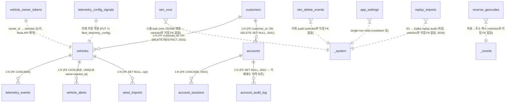

# TeslaFleet DB 스키마 + 관계도

> **DB**: PostgreSQL 16 (AWS RDS **db.t4g.small**) · **마이그**: Alembic head **0050** (2026-06-30 v1.7.9 — `ix_te_places` places 커버링 부분 인덱스 `(vehicle_id,timestamp) INCLUDE(latitude,longitude) WHERE speed_kph≤3.0`: places가 lat/lng 미커버로 Parallel Seq Scan(5GB·38s)→index-only(Heap Fetches 0)로 504 제거 · 0049 `ix_te_charging`→`ix_te_charging_active` charge-sessions 부분 인덱스 정밀화(sticky 전력행 heap 스캔 504 제거) · 0048 battery/vampire 커버링 + 0047 분석 가속 3종 · 0046 accounts OTP(TOTP) MFA 7종 · 0045 account_sessions IP/위치) · 2026-05-28~29 RDS path: db.t4g.micro → t4g.large (catch-up 가속, 3분 다운) → t4g.medium → **t4g.small** (일상 저부하 확인 후 단계적 다운그레이드, 누적 월 -$73)
> **베이스 코드**: `backend/app/models.py` + `backend/alembic/versions/`
> **운영**: 이 문서는 알렘빅 마이그가 추가될 때마다 동기화 필수 (하단 §운영 규칙 참조)
> **2026-06-01 갱신**: 라이브 `information_schema` 대조로 §2 전 테이블 컬럼 정정. 이전 문서가 코드와 다수 drift였음(telemetry_events id UUID·odometer_km·컬럼명, vehicle_alerts/owner_tokens id PK, audiences/scopes JSONB, sim_runs `vins`·`duration_seconds`, sim_delete_events `deleted_at`·`source`, seed_imports created_at 없음, app_settings key-value, **telemetry_config_signals** 테이블명·`display_order` 등). **정답 = `backend/app/models.py` + 라이브 DB.**

## 목차
1. [관계도 (ERD)](#1-관계도-erd)
2. [테이블 상세](#2-테이블-상세)
3. [인덱스 정책](#3-인덱스-정책)
4. [Alembic 마이그 이력](#4-alembic-마이그-이력)
5. [운영 규칙](#5-운영-규칙)

---

## 1. 관계도 (ERD)



**핵심 흐름** (15 테이블):
- **차량 = `vehicles`**: live(Tesla 실차량) / seeded(S3 dump 복사) / simulated(시뮬 SIM-VIN) 3 source
- **시계열 = `telemetry_events`**: 차량 1대당 수십만~수백만 row. carry-forward 패턴(`vehicles.latest_telemetry` JSONB snapshot)
- **알림 = `vehicle_alerts`**: started_at + ended_at 구간. severity는 name pattern(`_a\d`=alert / `_w\d`=warning)
- **차주 = OAuth `vehicle_owner_tokens`**: Tesla OAuth + KMS envelope encryption
- **고객사 = `customers`**: 1:N vehicles 그룹핑 (Alembic 0030)
- **신호 설정 = `telemetry_config_signals`**: Tesla fleet_telemetry_config PUT 시 사용
- **시뮬레이션 = `sim_runs`**: SIM-VIN 차량 + 메시지 생성 task
- **Seed 적재 = `seed_imports`**: S3 dump 파일별 audit
- **삭제 audit = `sim_delete_events`**: SIM/seeded 차량 삭제 job (in_progress/completed/failed 추적)
- **주소 캐시 = `reverse_geocodes`**: 좌표→주소 Google Geocoding 결과 (좌표 5자리 라운딩 + lang 키)
- **Replay audit = `replay_imports`**: S3 → Kafka 데이터 replay 작업 추적 (Alembic 0035, Bronze Replay UI)
- **계정 = `accounts` + `account_sessions` + `account_audit_log`**: 앱 로그인(0041)·보안 강화(0042 — 로그인 잠금·강제 비번변경·세션 메타·영속 감사로그). admin/manager(고객사 스코프) + DB 서버측 세션(즉시 revoke)

---

## 2. 테이블 상세

### 2.1 `vehicles` (Alembic 0001 생성, ~0031 변경)
차량 마스터. live(실 Tesla) / seeded(복사 dump) / simulated(SIM-) 3 source 통합.

| 컬럼 | 타입 | 제약 / 기본값 | 비고 |
|---|---|---|---|
| `id` | UUID | PK, default uuid4 | |
| `vin` | String(17) | UNIQUE, NOT NULL | Tesla VIN. SIM-prefix는 시뮬 |
| `display_name` | String(64) | NOT NULL | |
| `model` | String(32) | NOT NULL | "Model 3" / "Model Y" 등 |
| `color` | String(32) | nullable | |
| `software_version` | String(64) | nullable | |
| `is_simulated` | Boolean | NOT NULL, default false | |
| `data_source` | String(16) | NOT NULL, default "live", CHECK in (live/seeded/simulated) | 0018 |
| `customer_id` | UUID | nullable, FK customers.id **ON DELETE RESTRICT** | 0030/0031 |
| `event_count` | BigInteger | NOT NULL, default 0 | 0024 비정규화 (telemetry_events COUNT 캐시) |
| `first_event_at` | TimestampTZ | nullable | 0024 |
| `last_event_at` | TimestampTZ | nullable | 0024, kafka 매 INSERT 시 atomic update |
| `latest_telemetry` | JSONB | nullable | 0027, carry-forward snapshot (kafka 매 INSERT 시 `jsonb \|\|` UPSERT) |
| `created_at` | TimestampTZ | NOT NULL, default now | |
| `updated_at` | TimestampTZ | NOT NULL, onupdate now | |

**인덱스**:
- `ix_vehicles_vin` (vin) UNIQUE
- `ix_vehicles_customer_id` (customer_id) — 고객사 필터

**Cascade** (vehicles 삭제 시):
- `telemetry_events.vehicle_id` ON DELETE CASCADE
- `vehicle_alerts.vehicle_id` ON DELETE CASCADE
- `seed_imports.vehicle_id` ON DELETE **SET NULL**
- (`sim_runs`·`sim_delete_events`는 vehicle_id FK 없음 — 차량과 직접 FK 관계 아님)

---

### 2.2 `telemetry_events` (Alembic 0001 생성, ~0040 변경)
Tesla streaming telemetry — 차량 1대당 수십만~수백만 row 누적. 컬럼 50+ (전체 신호).

| 컬럼 | 타입 | 제약 | 비고 |
|---|---|---|---|
| `id` | UUID | PK, default uuid4 | (BigInteger 아님 — UUID) |
| `vehicle_id` | UUID | NOT NULL, FK vehicles.id CASCADE | |
| `timestamp` | TimestampTZ | NOT NULL, index | Tesla `createdAt` (delta-encoded — 변경 신호만 row) |
| `latitude` / `longitude` / `altitude_m` | Float | nullable | NaN/Inf/범위초과 차단(parser). altitude는 시뮬 only |
| `speed_kph` / `heading_deg` | Float | nullable | |
| `gear` | String(16) | nullable | P/R/N/D/SNA/Unknown/Invalid (0016 CHECK, 0038 확장 — Tesla ShiftState 전체. String(4)는 Unknown/Invalid 적재 실패) |
| `odometer_km` / `power_w` | Float | nullable | |
| `battery_level` / `usable_battery_level` | Float | nullable | SoC % |
| `battery_range_km` / `est_battery_range_km` / `rated_range_km` / `ideal_battery_range_km` | Float | nullable | |
| `battery_heater_on` | Boolean | nullable | |
| `charge_state` | String(32) | nullable | enum string (ChargeState/ChargingState alias 통합) |
| `charging_power_kw` / `charge_amps` / `charge_limit_soc` / `charger_voltage_v` / `charger_actual_current_a` | Float | nullable | |
| `time_to_full_charge_hours` | Float | nullable | |
| `charge_port_door_open` / `fast_charger_present` | Boolean | nullable | |
| `fast_charger_type` | String(32) | nullable | |
| `inside_temp_c` / `outside_temp_c` / `driver_temp_setting_c` / `passenger_temp_setting_c` | Float | nullable | |
| `is_climate_on` / `is_preconditioning` | Boolean | nullable | |
| `defrost_mode` / `climate_keeper_mode` | String(16) | nullable | |
| `tpms_pressure_{fl,fr,rl,rr}` | Float | nullable | bar |
| `tpms_hard_warning_{fl,fr,rl,rr}` | Boolean | nullable | tireLocationValue 4륜 분해 (0033 parser) |
| `locked` / `sentry_mode` | Boolean | nullable | |
| `vehicle_state` | String(16) | nullable | |
| `pack_voltage_v` / `pack_current_a` | Float | nullable | |
| `lifetime_energy_used_kwh` / `energy_remaining_kwh` | Float | nullable | |
| `isolation_resistance_ohm` | Float | nullable | (kohm 아님 — ohm) |
| `longitudinal_acceleration` / `lateral_acceleration` | Float | nullable | (lat_accel_g/long_accel_g 아님) |
| `pedal_position_pct` / `brake_pedal_pos_pct` | Float | nullable | v3 promote (0004) |
| `motor_speed_rear_rpm` / `motor_torque_rear_nm` | Float | nullable | v3 promote (0004) |
| `powershare_status` / `powershare_type` | String(32) | nullable | 0023 |
| `powershare_stop_reason` | String(48) | nullable | 0023 |
| `powershare_hours_left` / `powershare_instantaneous_power_kw` | Float | nullable | 0023 |
| `raw_data` | JSONB | nullable | 매핑 안 된 키 + 메타데이터 |

> ⚠️ `created_at`/`online_state` 컬럼은 실제 테이블에 **없다**(과거 문서 오기). 시각 기준은 `timestamp`.

**인덱스** (라이브 기준):
- `ix_telemetry_events_vehicle_timestamp` (vehicle_id, timestamp DESC) — 메인 조회 패턴 (이전 문서 `..._vehicle_id_timestamp` 오기)
- `ix_telemetry_events_timestamp` (timestamp) — 단일 컬럼. (`ix_telemetry_events_vehicle_id`는 0039에서 드롭 — composite 선두 컬럼과 완전 중복, 핫인서트 쓰기 증폭 절감. timestamp 인덱스는 운영 ad-hoc 쿼리 실측 확인 전까지 유지)
- `idx_te_month_utc` ((date_trunc('month', timestamp AT TIME ZONE 'UTC'))) INCLUDE (vehicle_id) — **0033 functional index, IMMUTABLE, event-stats 8s→<1s**
- `ix_te_vehicle_ts_geo` (vehicle_id, timestamp DESC) WHERE latitude IS NOT NULL AND longitude IS NOT NULL — **0037 GPS fallback 부분 인덱스(PG 전용·CONCURRENTLY), list_vehicles DISTINCT ON / get_vehicle_latest / route_by_vehicle 위치 조회 가속**
- `uq_te_vehicle_ts_payload` UNIQUE (vehicle_id, timestamp, md5(coalesce(raw_data::text,''))) — **0040 중복 INSERT 원천 차단(PG 전용·CONCURRENTLY). consumer/seed의 ON CONFLICT DO NOTHING이 이 인덱스로 exact 재전송본(replay·at-least-once)을 INSERT 단계에서 skip. collision(같은 ts·다른 payload)은 md5가 달라 보존. ⚠️ raw_data는 매핑 안 된 키만 담아 키가 typed 컬럼 미포함 — (vehicle,ts) 유니크 전제(라이브 실측 collision 0)라 무해, 0040 docstring 참조**

> 0026은 `EXTRACT(YEAR/MONTH FROM timestamptz)` functional index가 IMMUTABLE 위반이라 upgrade를 완전 noop(`pass`)으로 둠 — **어떤 인덱스도 생성되지 않음**(0033 date_trunc 패턴으로 대체).

**UNIQUE**: `uq_te_vehicle_ts_payload` (vehicle_id, timestamp, md5(coalesce(raw_data::text,''))) — 0040. exact 재전송 중복만 INSERT 단계 차단(consumer/seed ON CONFLICT DO NOTHING), collision(같은 ts·다른 payload) 보존. 잔여 점검·정리는 `/admin/duplicates`(백스톱).

---

### 2.3 `vehicle_alerts` (Alembic 0005 생성, 0011·0013·0033 변경)
Tesla 알림(결함/경고/info). 차량별 시간 구간(`started_at` ~ `ended_at`).

| 컬럼 | 타입 | 제약 | 비고 |
|---|---|---|---|
| `id` | UUID | PK, default uuid4 | (BigInteger 아님 — UUID) |
| `vehicle_id` | UUID | NOT NULL, FK vehicles.id CASCADE | |
| `name` | String(64) | NOT NULL | 예: `VCFRONT_a361_washerFluidLow` |
| `started_at` | TimestampTZ | NOT NULL | |
| `ended_at` | TimestampTZ | nullable | NULL=현재 active 또는 미수신 |
| `audiences` | JSONB | NOT NULL, default `[]` | ["Customer", "Service"] (text[] 아닌 **JSONB** 배열) |
| `received_at` | TimestampTZ | NOT NULL | Tesla 수신 시각 |
| `raw_data` | JSONB | nullable | |

**인덱스** (라이브 기준):
- `ix_vehicle_alerts_vid_started_desc` (vehicle_id, started_at DESC) — 메인 조회 (이전 문서 `..._vehicle_id_started_at_desc` 오기)
- `ix_vehicle_alerts_vid_started` (vehicle_id, started_at) / `ix_vehicle_alerts_active` — 보조
- `uq_vehicle_alerts_vid_name_started` (vehicle_id, name, started_at) UNIQUE — seed 적재 시 ON CONFLICT
- `idx_va_month_utc` ((date_trunc('month', started_at AT TIME ZONE 'UTC'))) INCLUDE (vehicle_id) — **0033**

**Severity 추정**: `name`에서 `_a\d` = alert(빨강) / `_w\d` = warning(노랑) / else = info(회색) — FE/BE 동일 규칙

---

### 2.4 `vehicle_owner_tokens` (Alembic 0006, 0014, 0017)
Tesla OAuth refresh/access token. KMS envelope encryption(AES-256-GCM aad=owner_id).

| 컬럼 | 타입 | 제약 | 비고 |
|---|---|---|---|
| `id` | UUID | PK, default uuid4 | (owner_id가 PK 아님 — id가 PK) |
| `owner_id` | Text | UNIQUE, NOT NULL, index | Tesla id_token `sub` claim |
| `owner_email` | Text | nullable | |
| `access_token_ct` / `access_token_nonce` / `access_token_dek` | String | nullable | 0014 KMS envelope(AES-256-GCM): 암호문 / nonce(IV) / 암호화된 data key. (ciphertext/iv/tag 명칭 아님) |
| `refresh_token_ct` / `refresh_token_nonce` / `refresh_token_dek` | String | nullable | refresh 동일 패턴 (평문 컬럼은 0017 drop) |
| `token_expires_at` | TimestampTZ | NOT NULL, index | |
| `scopes` | JSONB | nullable | granted scope (v1.5.x 이후 실제 granted) |
| `created_at` / `updated_at` | TimestampTZ | NOT NULL | |

**CHECK 제약**: 0015가 추가한 `ck_owner_tokens_access_mutex` / `..._refresh_mutex`(평문/envelope 동시 존재 차단)는 **0017에서 평문 컬럼과 함께 드롭됨** — 현 head 기준 이 테이블에 CHECK 제약 **없음** (envelope only)

---

### 2.5 `customers` (Alembic 0030)
고객사 — 1:N 차량 그룹.

| 컬럼 | 타입 | 제약 | 비고 |
|---|---|---|---|
| `id` | UUID | PK, default uuid4 | |
| `name` | String(64) | UNIQUE, NOT NULL | |
| `created_at` / `updated_at` | TimestampTZ | NOT NULL | |

**연관**: `vehicles.customer_id` (nullable, FK **ON DELETE RESTRICT** v1.5.x)

---

### 2.6 `telemetry_config_signals` (Alembic 0007, 0021)
Tesla fleet_telemetry_config 동기화 대상 신호 목록. PUT 시 전체 set replace.

| 컬럼 | 타입 | 제약 | 비고 |
|---|---|---|---|
| `signal_name` | String(64) | **PK** | Tesla proto Field enum (id 컬럼 없음 — signal_name이 PK) |
| `interval_seconds` | Integer | NOT NULL | |
| `minimum_delta` | Float | nullable | |
| `resend_interval_seconds` | Integer | nullable | |
| `enabled` | Boolean | NOT NULL, default true | |
| `display_order` | Integer | NOT NULL, default 0 | UI 표시 순 (order_index 아님) |
| `last_validation_status` | String(16) | nullable | "valid"/"invalid"/"skipped"/NULL (0021) |
| `last_validation_at` | TimestampTZ | nullable | |
| `last_validation_error` | String(500) | nullable | |
| `updated_at` | TimestampTZ | NOT NULL, onupdate now | (created_at 컬럼 없음) |

**CHECK**: status in (valid/invalid/skipped/NULL)

---

### 2.7 `sim_runs` (Alembic 0008, 0012, 0020)
시뮬레이터 task — VIN별 Kafka 메시지 produce.

| 컬럼 | 타입 | 제약 | 비고 |
|---|---|---|---|
| `id` | UUID | PK, default uuid4 | |
| `name` | String(64) | nullable | |
| `vins` | JSONB | NOT NULL | VIN **배열** (단수 `vin` 아님 — SIM- prefix) |
| `speed_multiplier` | Float | NOT NULL, default 1.0 | |
| `scenario` | String(32) | NOT NULL, default "driving" | driving/charging/idle/mixed |
| `signal_set` | String(16) | NOT NULL, default "default" | default/rich (0010) |
| `interval_seconds_override` | Integer | nullable, CHECK `ck_sim_runs_interval_override_range`(NULL 또는 1~86400) | 0020 — per-run 빈도 override |
| `include_alerts` | Boolean | NOT NULL, default false | |
| `duration_seconds` | Integer | NOT NULL, default 0 | 0=무제한 (`duration_minutes` 아님 — **초** 단위) |
| `status` | String(16) | NOT NULL, default "pending", index | pending/running/stopped/completed/failed/interrupted |
| `started_at` / `stopped_at` | TimestampTZ | nullable | |
| `messages_sent` / `errors_count` | Integer | NOT NULL, default 0 | |
| `last_error` | Text | nullable | |
| `created_at` / `updated_at` | TimestampTZ | NOT NULL | |

---

### 2.8 `sim_delete_events` (Alembic 0009, 0022)
SIM/seeded 차량 삭제 audit + async job 상태.

| 컬럼 | 타입 | 제약 | 비고 |
|---|---|---|---|
| `id` | UUID | PK, default uuid4 | |
| `deleted_at` | TimestampTZ | NOT NULL, default now, index | (`started_at` 아님) |
| `deleted_vehicles` | Integer | NOT NULL | |
| `cascade_deleted_events` / `cascade_deleted_alerts` | Integer | NOT NULL, default 0 | |
| `source` | String(16) | NOT NULL, default "api" | "api"(HTTP DELETE) / "script"(CLI) (`requested_by` 아님) |
| `note` | String(256) | nullable | `seeded-month:YYYY-MM` / `seeded:VIN` / `sim:` 등 |
| `status` | String(16) | nullable | in_progress/completed/failed/NULL (0022) |
| `finished_at` | TimestampTZ | nullable | 0022 |
| `error` | String(500) | nullable | |

> ⚠️ `vehicle_id` 컬럼 없음(과거 문서 오기). 차량별 삭제는 `note`로 식별.

---

### 2.9 `seed_imports` (Alembic 0019, 0034)
S3 dumps/ 적재 audit + 실패 재시도 추적.

| 컬럼 | 타입 | 제약 | 비고 |
|---|---|---|---|
| `s3_key` | Text | PK | S3 object key |
| `loaded_at` | TimestampTZ | NOT NULL, default now | (시각 기준은 이 컬럼 — `created_at` 컬럼 없음) |
| `vehicle_id` | UUID | nullable, FK vehicles.id **SET NULL** | (다중 VIN 파일에서 null) |
| `event_count` | Integer | NOT NULL, default 0 | (BigInteger 아님) |
| `file_size_bytes` | BigInteger | NOT NULL, default 0 | |
| `status` | String(16) | NOT NULL, CHECK ('completed','failed','in_progress') | 0034: in_progress 추가 |
| `last_error` | Text | nullable | (String(1000) 아님) |

**ON CONFLICT (s3_key)**: 동시 ingest race 시 IntegrityError → 409 reject (v1.5.x)
**0034 CHECK 확장**: `_ingest_one_dump`가 시작 시점에 status='in_progress' INSERT → 완료 시 'completed' UPDATE하는 패턴(CR1) 도입. 0019 CHECK는 ('completed','failed')만 허용해 모든 in_progress INSERT가 CHECK violation으로 영구 차단되던 라이브 버그 fix.

---

### 2.10 `app_settings` (Alembic 0007)
key-value 설정 저장 (단가/가정값 등). 키별 1 row.

| 컬럼 | 타입 | 제약 | 비고 |
|---|---|---|---|
| `key` | String(64) | PK | 설정 키 |
| `value` | Text | NOT NULL | 설정 값(문자열) |
| `updated_at` | TimestampTZ | NOT NULL, onupdate now | |

---

### 2.11 `reverse_geocodes` (Alembic 0032)
좌표→주소 변환(reverse geocoding) Google API 결과 캐시.

| 컬럼 | 타입 | 제약 | 비고 |
|---|---|---|---|
| `id` | BigInteger | PK auto | |
| `lat_round` / `lng_round` | Float | NOT NULL | 5자리 라운딩(~1.1m) |
| `language` | String(8) | NOT NULL | "ko"/"en" |
| `address_full` | String(512) | nullable | trim 512 (v1.5.x H6) |
| `address_short` | String(128) | nullable | 시·도·구·동 (국가 제외) |
| `country_code` | String(8) | nullable | "KR" 등 |
| `status` | String(32) | NOT NULL | ok/zero_results/api_error |
| `error` | String(256) | nullable | |
| `created_at` / `updated_at` | TimestampTZ | NOT NULL | |

**UNIQUE**: `uq_reverse_geocodes_latlng_lang` (lat_round, lng_round, language)

**캐시 정책**: ok/zero_results 영구 / api_error/disabled는 매 호출 재시도 + UPSERT (v1.5.x P3)

---

### 2.12 `replay_imports` (Alembic 0035) — v1.5.8 Phase B

S3 → Kafka replay 작업 audit. SeedImport(0019)와 별개 워크플로우 — `topics/` prefix를 Kafka로 재 publish하여 kafka_consumer가 DB 적재 + s3-archiver가 Bronze envelope dual-publish.

| 컬럼 | 타입 | 제약 | 비고 |
|---|---|---|---|
| `id` | UUID | PK | `gen_random_uuid()` |
| `prefix` | Text | NOT NULL | S3 prefix (예: `topics/tesla_V/year=2025/`) |
| `rate_limit` | Integer | NOT NULL default 500 | publish rate (msg/s, 1~5000) |
| `max_objects` | Integer | nullable | 테스트용 객체 수 cap |
| `status` | String(16) | NOT NULL, CHECK ('pending','running','completed','failed','stopped') | |
| `total_objects` | BigInteger | NOT NULL default 0 | S3 list 결과 |
| `processed_objects` | BigInteger | NOT NULL default 0 | progressive UPDATE |
| `total_lines` | BigInteger | NOT NULL default 0 | line 누적 |
| `published_lines` | BigInteger | NOT NULL default 0 | Kafka send 성공 |
| `errors` | Integer | NOT NULL default 0 | |
| `error_message` | Text | nullable | failure 상세 (2000자 cap) |
| `started_at` | TimestampTZ | nullable | running 시작 |
| `finished_at` | TimestampTZ | nullable | completed/failed/stopped |
| `created_at` | TimestampTZ | NOT NULL | |

**인덱스**: `ix_replay_imports_created_at_desc` — 이력 list 가속 · `uq_replay_imports_prefix_active`(0036) — **UNIQUE(prefix) WHERE status IN ('pending','running')**: 같은 prefix의 동시 replay start race(TOCTOU) 차단 — 중복 start는 IntegrityError → 409
**Endpoints**: `/api/v1/admin/bronze-replay/{preview,start,list,{id},{id}/stop}` (API_REFERENCE §3.9)
**Lifespan cleanup**: backend 재시작 시 status IN ('pending','running') row를 'failed'로 마킹 (dangling 정리, SimRun 패턴)

### 2.13 `accounts` (Alembic 0041, 보안 0042, OTP MFA 0046) — v1.7.0 계정 로그인 + v1.7.1 보안 + v1.7.5 MFA

앱 로그인 계정(nginx Basic auth 대체). role: **admin**(전 메뉴·전 데이터) / **manager**(고객사 소속 — 메인현황·차량정보만, 자기 고객사 데이터만). manager는 `customer_id` 분배 전(NULL) 로그인 불가. 가입은 email만 입력(비번 디폴트 `modapl#123`), Admin이 계정 설정에서 분배/리셋.

| 컬럼 | 타입 | 제약 | 비고 |
|---|---|---|---|
| `id` | UUID | PK | `uuid4` |
| `email` | String(255) | NOT NULL, **UNIQUE**, index | 소문자 정규화 저장(라우터 강제) |
| `password_hash` | String(256) | NOT NULL | scrypt(stdlib) `scrypt$n$r$p$salt$dk` — `utils/passwords.py` |
| `role` | String(16) | NOT NULL default 'manager', **CHECK ('admin','manager')** | `ck_accounts_role` |
| `customer_id` | UUID | FK customers **ON DELETE SET NULL**, nullable, index | 고객사 삭제 시 자동 미분배(로그인 차단) — vehicles(RESTRICT)와 다른 의도 |
| `created_at` / `updated_at` | TimestampTZ | NOT NULL | |
| `last_login_at` | TimestampTZ | nullable | 로그인 시 갱신 |
| `must_change_password` | Boolean | NOT NULL default false | (0042) 첫 로그인 강제 비번변경 게이트 — true면 데이터/admin 403 `password_change_required` |
| `failed_login_count` | Integer | NOT NULL default 0 | (0042) 로그인 잠금 카운터 — 8회 초과 시 지수 백오프, 잠금 만료 시 리셋 |
| `lockout_until` | TimestampTZ | nullable | (0042) 지수 백오프 잠금 만료 시각 |
| `password_changed_at` | TimestampTZ | nullable | (0042) 비번 마지막 변경 시각 |
| `mfa_enabled` | Boolean | NOT NULL default false | (0046) OTP(TOTP) 등록 완료 — true면 로그인 시 2단계 OTP 요구 |
| `mfa_secret_ct` / `mfa_secret_nonce` / `mfa_secret_dek` | String(512) / String(64) / String(1024) | nullable | (0046) TOTP base32 secret **KMS 봉투암호화**(OwnerToken envelope 동형·평문 미저장) |
| `mfa_backup_codes` | Text | nullable | (0046) 1회용 백업코드 scrypt 해시 JSON `[{h,used}]` |
| `mfa_enrolled_at` | TimestampTZ | nullable | (0046) OTP 등록 시각 |
| `mfa_last_used_step` | BigInteger | nullable | (0046) 마지막 사용 TOTP step(=시각//30) — 같은 코드 재사용(replay) 차단(RFC 6238 §5.2) |

**부트스트랩**: backend lifespan이 admin 0명일 때 `ADMIN_EMAIL`/`ADMIN_BOOTSTRAP_PASSWORD`(.env, deploy.sh 생성·보존)로 1회 생성.
**Endpoints**: `/api/v1/auth/account/{signup,login,logout,me,password}` + `/api/v1/admin/accounts*` (API_REFERENCE 참조)

### 2.14 `account_sessions` (Alembic 0041, 메타 0042 · IP/위치 0045)

DB 서버측 세션 — 쿠키(**`__Host-tf_account`**, HttpOnly·Secure·Lax·Path=/·30일)에는 랜덤 토큰 원문, DB에는 **sha256 해시만**(유출 시 세션 위조 불가). 비번 리셋/고객사 분배 변경 시 해당 계정 세션 전부 삭제 → 즉시 로그아웃(서명 쿠키 방식과 달리 회수 가능). 계정당 cap 10(로그인 시 oldest 삭제).

| 컬럼 | 타입 | 제약 | 비고 |
|---|---|---|---|
| `id` | UUID | PK | `uuid4` |
| `account_id` | UUID | FK accounts **ON DELETE CASCADE**, NOT NULL, index | 계정 삭제 시 세션 동반 삭제 |
| `token_hash` | String(64) | NOT NULL, **UNIQUE** | sha256(hex) — 조회 키 |
| `created_at` | TimestampTZ | NOT NULL | |
| `expires_at` | TimestampTZ | NOT NULL, index | 발급+30일(절대 만료) |
| `last_seen_at` | TimestampTZ | nullable | (0042) 유휴 만료(7일 무활동)·throttled 갱신·세션 목록 |
| `ip_hash` | String(64) | nullable | (0042) sha256(IP+secret) — 비교용 PII 완화 해시 |
| `ip_address` | String(45) | nullable | **(0045)** 로그인 시점 원문 IP(활성 세션 표기). 토큰 회전 시 같은 행 유지 |
| `country` | String(64) | nullable | **(0045)** CloudFront-Viewer-Country-Name |
| `city` | String(64) | nullable | **(0045)** CloudFront-Viewer-City |
| `user_agent` | String(256) | nullable | (0042) 세션 목록/탈취 탐지 |

### 2.15 `account_audit_log` (Alembic 0042 · IP/위치 0044) — v1.7.1 보안 감사

로그인 성공/실패·잠금·비번 변경/리셋·고객사 분배·계정 생성/삭제·승격·세션 revoke·X-Admin-Key 사용 등 보안 이벤트 **영속 기록**(logger.info 휘발 대체 — 침해 시 포렌식). `GET /admin/accounts/audit`.

| 컬럼 | 타입 | 제약 | 비고 |
|---|---|---|---|
| `id` | BigInt(SQLite Integer 변형) | PK autoincrement | |
| `account_id` | UUID | FK accounts **ON DELETE SET NULL**, nullable, index | 계정 삭제돼도 이력 보존 |
| `event` | String(48) | NOT NULL, index | login_success/login_fail/login_locked/logout/signup/password_change/password_reset/customer_assign/account_create/account_delete/admin_promote/admin_demote/session_revoke/admin_key_used/force_reset_rearm/mfa_enabled/mfa_disabled/mfa_verify_fail/mfa_backup_used/mfa_reset |
| `actor` | String(255) | nullable | 행위 주체(email / 'system(...)' / 'x-admin-key') |
| `target_email` | String(255) | nullable | 대상 계정 |
| `detail` | String(512) | nullable | 부가정보 |
| `ip_hash` | String(64) | nullable | (0042) sha256(IP+secret) — 세션 비교용 PII 완화 해시 |
| `ip_address` | String(45) | nullable | **(0044)** 접속자 원문 IP(IPv6 max 45). 출처=**CloudFront-Viewer-Address 1순위**(edge set·위조 불가), 헤더 부재 시 X-Forwarded-For 최좌측→peer 폴백. admin 포렌식용 |
| `country` | String(64) | nullable | **(0044)** CloudFront-Viewer-Country-Name(대략 위치) |
| `city` | String(64) | nullable | **(0044)** CloudFront-Viewer-City |
| `created_at` | TimestampTZ | NOT NULL, index | |

> `event` enum 끝의 `force_reset_rearm`(0043 세션 기준 추가) = `ADMIN_FORCE_RESET` 0→1 전이 1회 발화 sentinel(one-shot edge-trigger — 재시작마다 admin 비번 되돌림 회귀 차단).
>
> **(0044) IP·위치**: `ip_address`(원문)·`country`·`city`는 admin 감사 화면 표기용. 위치는 CloudFront origin request policy `AllViewerAndCloudFrontHeaders`가 주입하는 Viewer 헤더(`CloudFront-Viewer-Country-Name`/`-City`)에서 채움 — 정책 미적용·직접 접근·시스템 이벤트(bootstrap)·구버전 행은 **NULL**. GeoIP DB·외부 API 불요(앱이 전부 CloudFront 뒤). `ip_hash`는 세션 비교용으로 유지(중복이지만 기존 데이터·세션 메타 정합).

**인덱스**:
- `ix_account_audit_log_account_id` (account_id) — 0042
- `ix_account_audit_log_event` (event) — 0042
- `ix_account_audit_log_created_at` (created_at) — 0042
- `ix_account_audit_log_event_created` (event, created_at) — **0043 복합** (event 필터 + created_at DESC 정렬을 backward index scan으로 커버 — `GET /admin/accounts/audit` 가속, perf audit R1)

---

## 3. 인덱스 정책

### 시계열 telemetry_events (5M+ row)
| 인덱스 | 컬럼 | 용도 |
|---|---|---|
| `ix_telemetry_events_vehicle_timestamp` | (vehicle_id, timestamp DESC) | 차량별 시계열 조회 (메인) |
| `ix_telemetry_events_timestamp` | (timestamp) | 단일 컬럼 (vehicle_id 단일 인덱스는 0039 드롭 — composite 중복) |
| `idx_te_month_utc` (0033) | (date_trunc('month', ts AT TIME ZONE 'UTC')) INCLUDE (vehicle_id) | 월별 통계 — **functional index IMMUTABLE** |
| `ix_te_vehicle_ts_geo` (0037) | (vehicle_id, timestamp DESC) WHERE lat/lng NOT NULL | GPS fallback 부분 인덱스(PG 전용) — list_vehicles DISTINCT ON / get_vehicle_latest / route_by_vehicle 위치 조회 |
| `ix_te_harsh_accel` (0047) | (vehicle_id, timestamp) WHERE `abs(longitudinal_acceleration)>=3 OR abs(lateral_acceleration)>=3` | **심화 분석 부분 인덱스(PG 전용·CONCURRENTLY)** — driving-events(#7) 급조작 sparse 스캔(5.8M→수백 행) |
| `ix_te_charging_active` (0049) | (vehicle_id, timestamp) WHERE `charge_state='Charging' AND charging_power_kw>0 AND (speed_kph IS NULL OR speed_kph<=1)` | **부분 인덱스(PG 전용·CONCURRENTLY)** — charge-sessions(#1,#8) 쿼리 필터와 정확히 일치하는 좁은 predicate. 넓던 0047 `ix_te_charging`을 DROP하고 교체(sticky 전력행 heap 스캔 504 제거) |
| `ix_te_analytics_metrics` (0047) | (vehicle_id, timestamp) INCLUDE (speed_kph, odometer_km, lifetime_energy_used_kwh, outside_temp_c) | **커버링 인덱스(PG 전용·~1GB)** — efficiency(#2)/speed-histogram(#10) index-only scan |
| `ix_te_battery_vampire` (0048) | (vehicle_id, timestamp) INCLUDE (battery_level, rated_range_km, energy_remaining_kwh, speed_kph, charging_power_kw, charge_state) | **커버링 인덱스(PG 전용·~1.3GB)** — battery-health(#11)/vampire-drain(#12) index-only scan (⚠️ 생성 후 VACUUM ANALYZE 1회 선행) |
| `ix_te_places` (0050) | (vehicle_id, timestamp) INCLUDE (latitude, longitude) WHERE `speed_kph<=3.0 AND latitude IS NOT NULL AND longitude IS NOT NULL` | **커버링 부분 인덱스(PG 전용·CONCURRENTLY)** — 자주 가는 장소(places) 정차 샘플만 담아 index-only scan(Heap Fetches 0), Parallel Seq Scan(5GB) 504 제거 |

> 0026은 `EXTRACT(YEAR/MONTH FROM timestamptz)` functional index가 IMMUTABLE 위반이라 upgrade가 완전 noop(`pass`) — **어떤 인덱스도 생성되지 않음**(0033 date_trunc로 대체).
> 0047/0048/0049/0050 분석 인덱스는 전부 PG 전용(SQLite는 `abs`/`INCLUDE`/`CONCURRENTLY` 미지원 → 마이그가 skip) + `CREATE INDEX CONCURRENTLY IF NOT EXISTS`(ACCESS EXCLUSIVE 회피·수동 선생성 시 no-op). 텔레메트리 ingestion 재개 시 write 증폭 trade-off(현재 정지).

### 시계열 vehicle_alerts
| 인덱스 | 컬럼 | 용도 |
|---|---|---|
| `ix_vehicle_alerts_vid_started_desc` | (vehicle_id, started_at DESC) | 차량별 알림 조회 (메인) |
| `ix_vehicle_alerts_vid_started` / `ix_vehicle_alerts_active` | (vehicle_id, started_at) / 보조 | |
| `uq_vehicle_alerts_vid_name_started` | (vehicle_id, name, started_at) UNIQUE | seed 적재 dedupe (ON CONFLICT) |
| `idx_va_month_utc` (0033) | (date_trunc('month', started_at AT TIME ZONE 'UTC')) INCLUDE (vehicle_id) | 월별 통계 |

### 외래키 인덱스
- `ix_vehicles_customer_id` (customer_id) — 0030 고객사 필터. 그 외 `ix_vehicles_vin`/`ix_vehicles_data_source`/`ix_vehicles_is_simulated`
- `ix_seed_imports_loaded_at_desc` (loaded_at DESC) — 적재 이력 list (이전 문서 `..._status_loaded_at` 오기)
- `sim_runs`: `ix_sim_runs_status`/`ix_sim_runs_active`/`ix_sim_runs_created_at` · `sim_delete_events`: `ix_sim_delete_events_deleted_at`
- `telemetry_config_signals`: PK(`signal_name`)가 곧 unique — 별도 `ix_..._signal_name` 인덱스는 라이브에 **없음**

### Replay audit (0035·0036)
- `ix_replay_imports_created_at_desc` (created_at DESC) — 이력 list 가속
- `uq_replay_imports_prefix_active` (0036) — UNIQUE(prefix) WHERE status IN ('pending','running') — 동시 start race 차단

### 계정 감사로그 (0042·0043)
- 단일 인덱스 3종(0042): `ix_account_audit_log_account_id`/`ix_account_audit_log_event`/`ix_account_audit_log_created_at`
- `ix_account_audit_log_event_created` (event, created_at) — **0043 복합** — `GET /admin/accounts/audit`의 event 필터 + created_at DESC 정렬을 한 번에 커버(backward index scan, perf audit R1)

---

## 4. Alembic 마이그 이력

> 전체 50개. 핵심만 — 상세는 `backend/alembic/versions/` 각 파일 docstring 참조.

| Rev | 요약 | 비고 |
|---|---|---|
| 0001~0006 | core schema (vehicles/telemetry_events/alerts/owner_tokens) | |
| 0007 | telemetry_config_signals + app_settings | 단가/가정값 key-value seed 포함 |
| 0008 | sim_runs | |
| 0009 | sim_delete_events | |
| 0010 | sim_runs.signal_set 컬럼 + 신호 11종 seed (+ destructive downgrade 가드 패턴) | |
| 0011 | vehicle_alerts (vehicle_id, started_at DESC) index | |
| 0012 | sim_runs.status CHECK | |
| 0013 | partial index 2 (sim_runs active=pending/running / vehicle_alerts active=ended_at IS NULL) | |
| 0014 | vehicle_owner_tokens KMS envelope columns | |
| 0015 | owner_tokens mutex CHECK (plain/envelope 동시 존재 차단) | **0017에서 평문 컬럼과 함께 드롭** — head 기준 부재 |
| 0016 | telemetry_events.gear CHECK | |
| 0017 | owner_tokens 평문 컬럼 drop | |
| 0018 | vehicles.data_source 3분류 (live/seeded/simulated) | |
| 0019 | seed_imports | |
| 0020 | sim_runs.interval_seconds_override | |
| 0021 | telemetry_config_signals.last_validation_* | |
| 0022 | sim_delete_events.status/finished_at/error (async job) | |
| 0023 | telemetry_events powershare 컬럼 5종 | |
| 0024 | vehicles.event_count/first_event_at/last_event_at (비정규화) | |
| 0025 | default LifetimeEnergyUsed signal seed | |
| 0026 | telemetry events functional index (**noop** — IMMUTABLE 위반) | |
| 0027 | vehicles.latest_telemetry JSONB (carry-forward snapshot) | |
| 0028 | carry-forward backfill (**noop** — FILTER non-aggregate) | |
| 0029 | carry-forward LATERAL backfill (**noop** — stuck) | |
| 0030 | customers + vehicles.customer_id (FK SET NULL) | |
| 0031 | customers FK SET NULL → **RESTRICT** | v1.5.x |
| 0032 | reverse_geocodes 캐시 테이블 | v1.5.x |
| 0033 | idx_te_month_utc / idx_va_month_utc (date_trunc functional, INCLUDE vehicle_id, CONCURRENTLY) | v1.5.x event-stats 8s→<1s |
| 0034 | seed_imports.status CHECK 확장 ('in_progress' 추가) | v1.5.x — 0019 CHECK violation으로 모든 ingest 영구 차단되던 라이브 버그 fix |
| 0035 | replay_imports 테이블 (Bronze Replay UI audit) | v1.5.8 Phase B — S3 → Kafka replay 작업 추적 + UI(/admin/seed) |
| 0036 | replay_imports prefix 부분 UNIQUE 인덱스 (active=pending/running) | v1.6.1 audit — start race(TOCTOU) 차단. upgrade 시 잔존 중복 active 정리 가드(PG) |
| 0037 | telemetry_events GPS fallback 부분 인덱스 (vehicle_id, timestamp DESC WHERE lat/lng NOT NULL) | v1.6.1 audit — 위치 fallback 정렬 스캔 제거. CONCURRENTLY + INVALID 잔존 DROP 가드 |
| 0038 | telemetry_events.gear String(4)→16 + CHECK 확장 (P/R/N/D/SNA/Unknown/Invalid) | v1.6.1 audit — Tesla ShiftState Unknown/Invalid 적재 실패(같은 Datum 전 신호 유실) fix |
| 0039 | `ix_telemetry_events_vehicle_id` 드롭 (DROP INDEX CONCURRENTLY) | 2026-06-10 audit — composite (vehicle_id, timestamp DESC) 선두 컬럼과 완전 중복, 핫인서트 쓰기 증폭·스토리지 절감 |
| 0040 | `uq_te_vehicle_ts_payload` UNIQUE (vehicle_id, timestamp, md5(coalesce(raw_data::text,''))) (CREATE UNIQUE INDEX CONCURRENTLY) | 2026-06-12 — 중복 INSERT 원천 차단(replay/at-least-once 재유입). 생성 전 윈도우 청크 dedup(디스크 스필 차단). consumer/seed ON CONFLICT DO NOTHING과 함께 적용 |
| 0041 | `accounts` + `account_sessions` 신설 (role CHECK, email UNIQUE, customer FK SET NULL, 세션 token_hash UNIQUE/CASCADE) | 2026-06-12 v1.7.0 — 계정 로그인(nginx Basic auth 대체). admin/manager(고객사 스코프) + DB 서버측 세션(즉시 revoke) |
| 0042 | accounts +must_change_password·failed_login_count·lockout_until·password_changed_at / account_sessions +last_seen_at·ip_hash·user_agent / **account_audit_log 신설** | 2026-06-12 v1.7.1 — 계정 보안 강화(P0+P1): 로그인 잠금·첫 로그인 강제 비번변경·세션 메타·영속 감사로그 |
| 0043 | account_audit_log (event, created_at) 복합 인덱스 ix_account_audit_log_event_created 신설 | 2026-06-15 v1.7.1 — GET /admin/accounts/audit event 필터+created_at 정렬 가속(perf audit R1) |
| 0044 | account_audit_log +ip_address·country·city | 2026-06-18 v1.7.4 — 보안 감사로그에 접속자 IP + 대략 위치(CloudFront viewer 헤더) |
| 0045 | account_sessions +ip_address·country·city | 2026-06-18 v1.7.4 — 활성 세션 목록에 로그인 IP + 위치 |
| 0046 | accounts +mfa_enabled·mfa_secret_ct/nonce/dek·mfa_backup_codes·mfa_enrolled_at·mfa_last_used_step | 2026-06-24 v1.7.5 — 계정 로그인 OTP 앱(TOTP) 다단계 인증. secret KMS 봉투암호화·mfa_last_used_step으로 코드 재사용 차단 |
| 0047 | telemetry_events 심화 분석 가속 인덱스 3종 (PG 전용·CONCURRENTLY): `ix_te_harsh_accel`(부분)·`ix_te_charging`(부분)·`ix_te_analytics_metrics`(커버링) | 2026-06-25 v1.7.7 — driving-events/charge-sessions/efficiency/speed-histogram cold 스캔(40~60s)을 부분/커버링 index-only scan으로 sub-second화 |
| 0048 | telemetry_events `ix_te_battery_vampire` 커버링 인덱스 (vehicle_id, timestamp INCLUDE 6컬럼, PG 전용·CONCURRENTLY) | 2026-06-26 v1.7.7 — battery-health(#11)/vampire-drain(#12)가 0047이 안 덮는 컬럼을 읽어 heap 풀스캔 → 커버링으로 가속(생성 후 VACUUM ANALYZE 선행) |
| 0049 | telemetry_events `ix_te_charging` DROP → `ix_te_charging_active` 신설 (vehicle_id, timestamp WHERE `charge_state='Charging' AND charging_power_kw>0 AND (speed_kph IS NULL OR speed_kph<=1)`, PG 전용·CONCURRENTLY) | 2026-06-30 v1.7.9 — charge-sessions 쿼리 필터와 정확히 일치하는 좁은 부분 인덱스로 교체(넓던 0047 predicate가 sticky 전력행을 heap 스캔 → 504). vampire는 0048 커버링 사용이라 넓은 옛 인덱스 회수 무해 |
| 0050 | telemetry_events `ix_te_places` 커버링 부분 인덱스 (vehicle_id, timestamp INCLUDE latitude/longitude WHERE `speed_kph≤3.0 AND lat/lng NOT NULL`, PG 전용·CONCURRENTLY) | 2026-06-30 v1.7.9 — 자주 가는 장소(places)가 lat/lng 미커버로 Parallel Seq Scan(5GB·38s) → index-only(Heap Fetches 0) 504 제거 |

---

## 5. 운영 규칙

### 5.1 알렘빅 마이그 추가 시 (필수)
1. `backend/alembic/versions/00XX_<name>.py` 작성 (template: 직전 마이그 참고)
2. `revision: str = "00XX"` + `down_revision: Union[str, None] = "..."` 명시
3. SQLite test 호환: `bind.dialect.name != "postgresql": return` 분기 또는 batch_alter_table 사용
4. **destructive 마이그** (column drop, FK 변경 등): `ALEMBIC_ALLOW_DESTRUCTIVE_DOWNGRADE` 가드 (0010 패턴)
5. **CONCURRENTLY 인덱스**: `with op.get_context().autocommit_block(): op.execute(...)` (0033 패턴)
6. **functional index**: timezone 명시 `AT TIME ZONE 'UTC'` 등 IMMUTABLE 확인 (0026 lesson)
7. **이 문서 동기화**:
   - §2 테이블 상세 — 새 컬럼/제약 행 추가
   - §3 인덱스 정책 — 새 인덱스 행 추가
   - §4 마이그 이력 — 새 row 추가
   - ERD (§1) — 관계 변경 시 mermaid 갱신

### 5.2 lessons (충돌 패턴)
- **0026 IMMUTABLE 위반**: `extract(YEAR FROM TIMESTAMPTZ)`는 timezone 의존 → 명시 timezone 없으면 IMMUTABLE 아님 → functional index 거부 → noop. 해결: `date_trunc('month', ts AT TIME ZONE 'UTC')` 패턴 (0033).
- **0028 FILTER non-aggregate**: `last_value() FILTER` window 미지원 → noop.
- **0029 LATERAL stuck**: 차량별 LATERAL 1.86M row 3분+ stuck → admin endpoint(`/refill-latest-snapshot`)로 분리 + lifespan backfill task.
- **0031 FK RESTRICT**: 직접 SQL DELETE 시 IntegrityError → 500 회피 위해 endpoint에서 try/except IntegrityError → 409.
- **JSONB carry-forward**: `vehicles.latest_telemetry = vehicles.latest_telemetry || :new_keys` atomic UPSERT(`jsonb ||`). NULL 키는 carry-forward로 보존.
- **PG 100 args 한도**: `jsonb_build_object`는 args 100 한도라 큰 chunk 분할 + `||` concat (0029/refill 패턴).

### 5.3 메모리 동기화 (Claude Code 운영)
이 문서는 `memory/db_schema.md`에 reference 등록 — Claude Code 차후 세션에서 자동 load. 마이그 추가 시 양쪽 동기화:
1. 이 파일 (`docs/DB_SCHEMA.md`) — 운영자/개발자 가시
2. `~/.claude/projects/-Users-gubosung-Project-BackEnd-TeslaFleet/memory/db_schema.md` — Claude Code reference (한 줄 요약)

---

## 부록: 빠른 SQL

### 차량 1대의 월별 row 수
```sql
SELECT date_trunc('month', timestamp AT TIME ZONE 'UTC') AS m, COUNT(*)
FROM telemetry_events
WHERE vehicle_id = :vid
GROUP BY m
ORDER BY m DESC;
```
→ `idx_te_month_utc` 활용 (0033).

### 차량별 가장 최근 좌표 (DISTINCT ON)
```sql
SELECT DISTINCT ON (vehicle_id) vehicle_id, latitude, longitude, timestamp
FROM telemetry_events
WHERE latitude IS NOT NULL AND longitude IS NOT NULL
ORDER BY vehicle_id, timestamp DESC;
```
→ `list_vehicles` fallback (v1.5.x).

### carry-forward backfill (admin)
```bash
curl -X POST /api/v1/vehicles/{vid}/refill-latest-snapshot
```
→ 차량별 컬럼별 LATERAL `LIMIT 1` + `jsonb_build_object || concat` (0027 패턴).

### 데이터 출처 통계
```sql
SELECT data_source, COUNT(*) FROM vehicles GROUP BY data_source;
```
